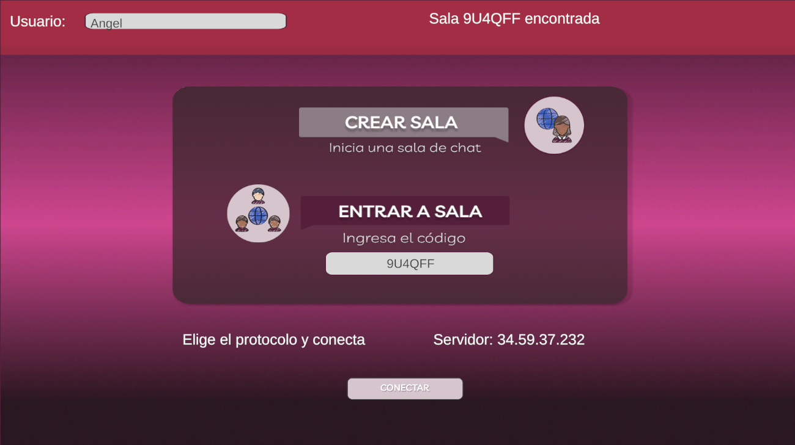
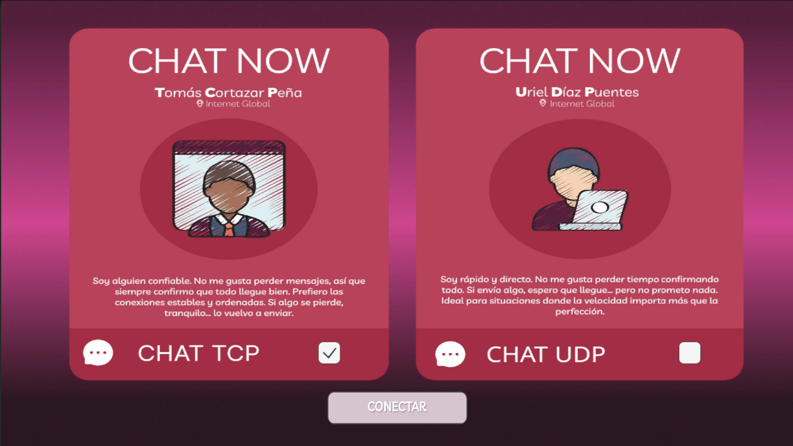
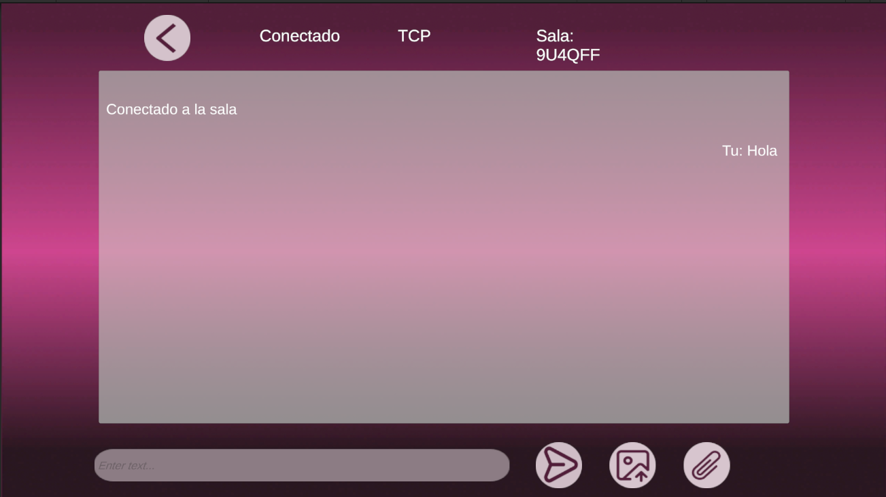
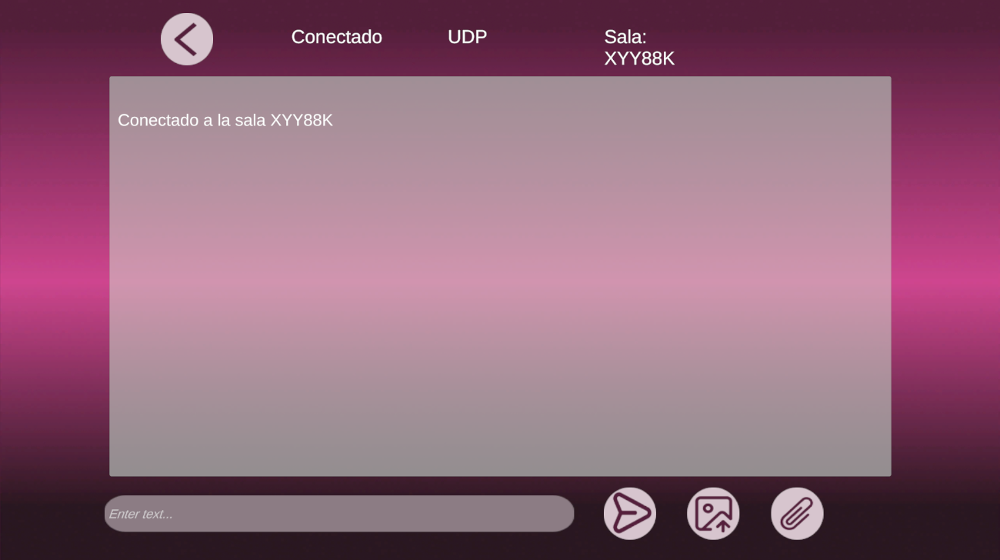

# Chat TCP/UDP - Arquitectura Cliente-Servidor en GCP

[](https://unity.com)
[](https://cloud.google.com/)
[](https://es.wikipedia.org/wiki/Protocolo_de_control_de_transmisi%C3%B3n)
[](https://es.wikipedia.org/wiki/Protocolo_de_datagramas_de_usuario)

Aplicación de chat desarrollada a partir del [fork de la base Chat-TCP-UDP](https://github.com/memin2522/Chat-TCP-UDP-base). Esta versión ha sido fuertemente modificada para evolucionar de una arquitectura **Peer-to-Peer (P2P)** a una arquitectura **Cliente-Servidor dedicada** alojada en **Google Cloud Platform (GCP)**.

Permite comunicación fluida en tiempo real (texto, imágenes y archivos PDF/Audio) organizando a los usuarios en **salas interactivas**, utilizando los protocolos TCP o UDP.

---

## Tabla de contenidos

- [Acerca del proyecto](#acerca-del-proyecto)
- [Arquitectura Actual (GCP)](#arquitectura-actual-gcp)
- [Características Principales](#características-principales)
- [Empezar](#empezar)
  - [Prerrequisitos](#prerrequisitos)
  - [Instalación](#instalación)
  - [Uso](#uso)
- [Estructura del Proyecto](#estructura-del-proyecto)
- [Documentación Adicional](#documentación-adicional)
- [Contacto](#contacto)

---

## Acerca del proyecto

Este proyecto fue modificado para la actividad de Servicios Multimedia. La aplicación permite a los clientes conectarse a un servidor dedicado alojado en GCP. Los usuarios pueden crear salas, compartir el código de la sala con otros, y chatear usando el protocolo de su preferencia (TCP o UDP).

La interfaz gráfica (UI) ha sido refactorizada para incluir menús de unificación donde el usuario:
1. Especifica su nombre.
2. Crea una nueva sala o ingresa un código para unirse a una existente.
3. Elige el protocolo de comunicación (TCP o UDP) de manera explícita antes de conectar.

## Arquitectura Actual (GCP)

A diferencia de la versión original (que era P2P y requería que un usuario alojara el servidor localmente en una escena separada), este proyecto implementa un servidor centralizado en C# (.NET) en una Máquina Virtual de GCP. 

```text
               +---------------------------------------------------+
               |               GOOGLE CLOUD PLATFORM               |
               |                                                   |
               |    +-----------------------------------------+    |
               |    |             Chat Server (.NET)          |    |
               |    |                                         |    |
               |    |   [ REST API ]   [ TCP ]     [ UDP ]    |    |
               |    |   (Port 5000)  (Port 9000) (Port 9001)  |    |
               |    +--------+------------+-----------+-------+    |
               |             |            |           |            |
               +-------------|------------|-----------|------------+
                             |            |           |
       HTTP (Room Creation/Check)         |           |
                             |            |           |
        +--------------------+            |           |
        |                                 |           |
+-------v---------+               +-------v---------+ +-------v---------+
|                 |               |                 | |                 |
|  Client 1 (PC)  |<--- TCP/UDP --->|  Client 2 (Mac) |<-> Client 3 ...   |
|                 |               |                 | |                 |
+-----------------+               +-----------------+ +-----------------+
```

- **API REST (Puerto 5000)**: Proporciona endpoints para la gestión de salas (creación y verificación de existencia de salas). El script `RoomManager.cs` maneja las solicitudes HTTP desde Unity.
- **Servidor TCP (Puerto 9000)**: Gestiona las conexiones TCP persistentes, el handshake de unión a las salas y el envío/recepción de datos de manera confiable y ordenada.
- **Servidor UDP (Puerto 9001)**: Gestiona las conexiones UDP para aquellos clientes que eligen una comunicación más rápida sin garantía de entrega.

En Unity, la conexión al servidor está centralizada de forma sencilla en el archivo `GCPconfig.cs`.

## Características Principales

- **Arquitectura Cliente-Servidor Dedicada**: Eliminadas las complicaciones de P2P y reenvío de puertos por parte del cliente final. El servidor en GCP centraliza todo.
- **Salas (Rooms)**: Generación dinámica del código de sala a través de la API REST para aislar diferentes sesiones de chat simultáneas.
- **Selección de Protocolo**: El usuario puede elegir entre enviar sus mensajes mediante **TCP** (confiable) o **UDP** (rápido).
- **Tipos de Mensajes Soportados**:
  - Mensajes de Texto.
  - Imágenes (Visualizadas directamente en los globos de chat).
  - Archivos adicionales (Ej. PDF) descargables en el dispositivo local.
- **Interfaz Renovada**: Escenas actualizadas en `GCP_UI` con prefab de burbujas ajustables, scroll views y notificaciones del sistema separadas.

---

## Flujo de Usuario (User Flow) e Interfaz

La aplicación cuenta con un flujo intuitivo y directo gracias a la refactorización de la UI. A continuación explicamos cada pantalla y su rol en la conexión:

### 1. Menú Principal (Creación y Unión de Salas)

En esta pantalla principal (escena `MainMenu`), el usuario inicia su interacción con la aplicación:
- **Nombre de usuario**: Campo obligatorio para identificarse en el chat.
- **Gestión de Salas**: 
  - El botón **"Nueva Sala"** hace una petición HTTP `POST` a nuestra API REST en GCP (Puerto 5000), el servidor crea una sala única virtual y devuelve un código de 6 caracteres que se muestra en pantalla.
  - El botón **"Verificar y Unirse"** permite introducir un código existente. La aplicación hace un `GET` a la API REST para asegurar que la sala sí existe antes de permitir avanzar.

### 2. Selector de Protocolo

Una vez validada la sala (ya sea porque la creamos o porque nos unimos exitosamente), se habilitan las opciones inferiores en el mismo menú principal:
- El usuario debe escoger explícitamente entre el protocolo **TCP** o **UDP**. La UI muestra una breve descripción de las ventajas de cada uno (TCP es seguro y ordenado, UDP es rápido pero no garantiza la entrega).
- Al tener la sala lista y el protocolo seleccionado, se habilita el botón **"Conectar a Sala"**, que cargará la escena de chat correspondiente en Unity.

### 3. Interfaz de Chat (TCP y UDP)


Ambas interfaces (tanto para TCP como para UDP) han sido unificadas visualmente para ofrecer la misma experiencia de usuario:
- Muestran el identificador de la sala actual y el protocolo en uso en la parte superior.
- **Burbujas dinámicas**: Los mensajes se renderizan en una lista mediante un **Scroll View** adaptativo. Los mensajes propios aparecen a la derecha (en verde) y los de los demás a la izquierda (en blanco).
- Adicionalmente, se cuenta con botones inferiores para **enviar imágenes** (las cuales se decodifican desde Base64 y se renderizan **dentro** del chat) y **enviar archivos (PDF/Audio)**, los cuales generan una burbuja con un botón que permite descargar el contenido recibido para guardarlo localmente en el PC.

---

## Empezar

### Prerrequisitos

- Unity Hub con **Unity 6000.3.8f1** o superior.
- Conexión a Internet activa (para comunicación con el servidor de GCP).

### Instalación

1. Clonar el repositorio.
2. Añadir y abrir el proyecto desde **Unity Hub**.
3. (Opcional) Si decides montar tu propio servidor en lugar de usar la IP por defecto de GCP:
   - Configura el servidor en una VM abriendo los puertos *5000, 9000 y 9001*.
   - Edita el archivo `Assets/Chat_TCP_UDP/Scenes/Services/GCPconfig.cs` y coloca la IP pública de tu VM en la constante `SERVER_IP`.

### Uso

Para probar y usar el chat en su versión actual con GCP:
1. En Unity, abre la escena del menú principal: `Assets/Chat_TCP_UDP/Scenes/GCP_UI/MainMenu.unity`.
2. Dale a **Play**.
3. Introduce tu nombre y dale a **Nueva Sala**.
4. Copia el código generado (o compártelo a otro cliente).
5. Selecciona el protocolo deseado (TCP o UDP).
6. Presiona el botón de **Conectar** (te redigirá a las escenas `Chat_TCP` o `Chat_UDP` en `GCP_UI`).

> **Nota:** Ya no es necesario ejecutar `Tcp_Server` o `Udp_Server` localmente (a menos que desees probar las versiones base/antiguas). Tu cliente se conectará directamente a la VM de GCP.

---

## Estructura del Proyecto

La estructura del proyecto difiere drásticamente de la versión original ya que incluye scripts y recursos nuevos para gestionar el Client-Server y despliegue del servidor:

```text
/
├── Assets/Chat_TCP_UDP/
│   ├── Scenes/
│   │   ├── GCP_UI/       # Nuevas escenas con la arquitectura GCP (MainMenu, Chat_TCP, Chat_UDP)
│   │   ├── Services/     # Scripts de servicios (API REST interact, GCPconfig, UI cliente GCP)
│   │   ├── TCP/          # [Legacy] Escenas TCP del proyecto en P2P
│   │   └── UDP/          # [Legacy] Escenas UDP del proyecto en P2P
│   ├── Scripts/          # Scripts base de conexión (TCPClient, UDPClient y Core network logics)
├── Server/               # Proyecto en C# (.NET) del servidor central para desplegar en GCP
│   ├── Database/         # Manejo de persistencia y base de datos (SQLite/JSON)
│   ├── Handlers/         # Manejadores del Socket y endpoints
│   ├── Models/           # Modelos de mensajería (JSON schemas) y clases de Room
│   ├── Program.cs        # Punto de entrada de la API REST y Sockets
│   └── deploy_gcp.sh     # Script Bash para automatizar el build y despliegue en GCP
└── docs/                 # Documentación técnica adicional detallada
```

### Carpetas Principales Modificadas/Creadas:
- **`Scenes/GCP_UI`**: Contiene la iteración final (Menú principal y salas de chat TCP y UDP unificadas al cliente).
- **`Scenes/Services`**: Aquí reside el puente de comunicación entre Unity y la lógica del servidor GCP. Implementa `HttpClient` para REST, serialización JSON robusta (ChatMsg) y dispatch handlers al hilo principal.
- **`Server`**: Contiene todo el código .NET (ASP.NET Core Minimal API / Sockets) para construir y correr el Chat Server independiente de Unity directamente en Linux/Windows.

---

## Documentación adicional

Toda la documentación en formato Markdown está en la carpeta `docs/`. Estos documentos explican las ideas fundacionales de diseño:

| Documento | Contenido |
|-----------|-----------|
| [ARQUITECTURA-Y-REQUISITOS.md](docs/ARQUITECTURA-Y-REQUISITOS.md) | Idea original y requerimientos del curso. |
| [COMUNICACION-TIEMPO-REAL.md](docs/COMUNICACION-TIEMPO-REAL.md) | Metodologías web vs UDP/TCP manual. |
| [HISTORIAL-Y-PERSISTENCIA.md](docs/HISTORIAL-Y-PERSISTENCIA.md) | Teoría sobre el persistido en servidor. |
| [GCP-SERVIDOR.md](docs/GCP-SERVIDOR.md) | Pasos sobre montaje del servidor en Google Cloud Compute Engine. |

---

## Contacto

**Equipo de Desarrollo**

Link del proyecto: [https://github.com/AngelQuinteroDev/Chat-TCP-UDP](https://github.com/AngelQuinteroDev/Chat-TCP-UDP)

---

> El código base para las interfaces P2P y sockets es el fork original adaptado de [memin2522/Chat-TCP-UDP-base](https://github.com/memin2522/Chat-TCP-UDP-base).
